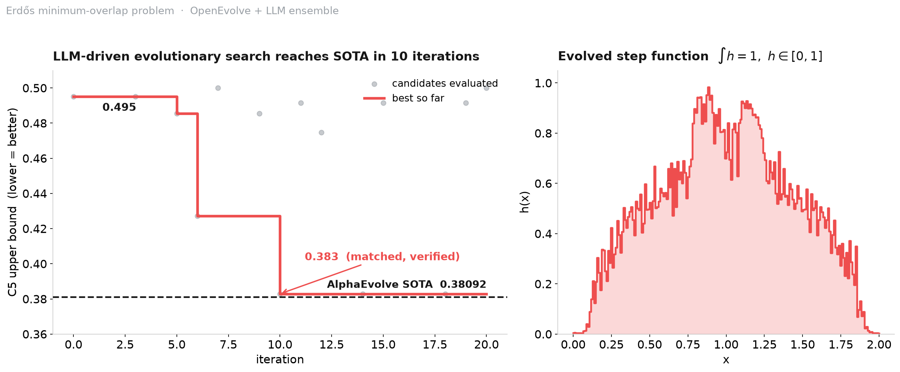

# Erdős Minimum Overlap — reproducing the SOTA bound with OpenEvolve

An evolutionary LLM coding pipeline ([OpenEvolve](https://github.com/codelion/openevolve),
the open-source AlphaEvolve) driven with a Gemini Flash + Pro ensemble that
re-discovers the state-of-the-art **numerical** upper bound for the Erdős
minimum overlap problem — starting from a weak baseline and converging in
~10 iterations.



## Result

| | C5 upper bound | vs AlphaEvolve benchmark (0.38092) |
|---|---|---|
| Baseline (`initial_program.py`) | 0.49507 | 77.0% |
| **Evolved (`best_program.py`)** | **0.38289** | **99.49%** |

Reached at iteration 10 of a 20-iteration run. The same bound (C5 ≈ 0.3829) was
reached **independently by two different LLM backends** — a Gemini Flash + Pro
ensemble and a free Groq run (`gpt-oss-120b`) — so the result is robust to the
choice of model. Independently verified with `verify.py` (recomputes the bound
and both constraints in pure numpy):

```
h in [0, 1]        : True
integral of h      : 1.00001927   (target 1.0, |dev| = 1.93e-05)
C5 (recomputed)    : 0.38289303
constraints PASS   : True
=> matches benchmark to 99.49%
```

### Honest framing

This is a **numerical** upper bound obtained by optimizing a discretized
(200-interval) step function with gradient descent — **not a new, formally
proven mathematical result**, and not a solution to an open problem. It
*reproduces / matches* the known state of the art (AlphaEvolve's 0.38092),
which demonstrates that the evolutionary pipeline works on a real research-grade
objective. Matched ≠ solved.

## The problem

The Erdős minimum overlap problem asks, informally, for a function
`h: [0,1] → [0,1]` with `∫h = 1` that minimizes the maximum overlap (cross-
correlation) between `h` and its complement `j = 1 − h`. The optimized quantity
here, `C5`, is an upper bound on the associated constant — lower is better.

## How it works

OpenEvolve treats the body of `initial_program.py` (marked with
`EVOLVE-BLOCK-START/END`) as the genome. Each iteration, an LLM proposes a
mutation; the candidate is scored by `evaluator.py`, which runs it and verifies
`h ∈ [0,1]`, `∫h ≈ 1` (tolerance 1e-3), and consistency of the reported bound.
Programs that violate a constraint score zero. A MAP-Elites / island scheme
keeps a diverse population.

The single change that produced the jump from 0.495 to 0.383 was relaxing the
constraint-penalty weight (`penalty_strength` 1e6 → 1e4): the original penalty
over-enforced `∫h = 1` at the expense of the actual objective. With a looser
penalty the optimizer finds a better balance while still satisfying the integral
constraint to within 2e-5 of 1.0.

## Reproduce

```bash
pip install numpy jax optax        # backend deps for the program
export GEMINI_API_KEY="..."        # or any OpenAI-compatible endpoint (see config.yaml)

# evolve (needs OpenEvolve: https://github.com/codelion/openevolve)
python openevolve-run.py initial_program.py evaluator.py --config config.yaml --iterations 20

# verify the shipped solution (no API key needed)
python verify.py
```

A free Groq backend works too — see the note in `config.yaml`.

## Files

- `initial_program.py` — starting point (the genome OpenEvolve evolves)
- `evaluator.py` — scores a candidate and checks the constraints
- `best_program.py` — the evolved solution
- `config.yaml` — the OpenEvolve / LLM-ensemble configuration
- `result.json` — metrics of the evolved solution
- `verify.py` — standalone, dependency-light verification

## Related work

Two Lean 4 formalizations of Erdős problems, merged into Google DeepMind's
[`formal-conjectures`](https://github.com/google-deepmind/formal-conjectures):

- [#4245 — Erdős 1084](https://github.com/google-deepmind/formal-conjectures/pull/4245) (merged)
- [#4244 — Erdős 1052](https://github.com/google-deepmind/formal-conjectures/pull/4244) (merged)

## Credits & license

- Evolutionary framework: [OpenEvolve](https://github.com/codelion/openevolve) (Apache-2.0)
- Problem, `initial_program.py` and `evaluator.py` adapted from
  [google-deepmind/alphaevolve_results](https://github.com/google-deepmind/alphaevolve_results) (Apache-2.0)

Released under the Apache-2.0 license to match upstream.
